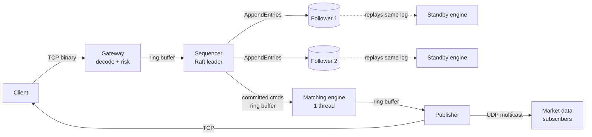
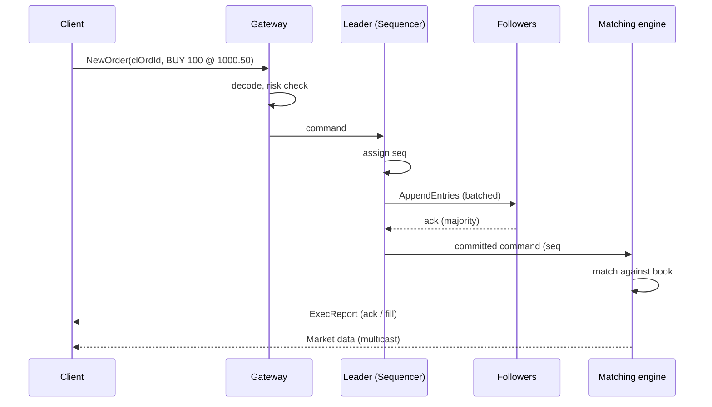

# trade-engine — Design

A fault-tolerant, low-latency exchange in Java.
Orders come in over TCP, get sequenced and replicated with Raft,
matched by a single-threaded deterministic engine, and results go
out as execution reports (TCP) and market data (UDP multicast).

> Status: design v1 (2026-09-29). Numbers marked **target** are
> goals to measure, not results. Only measured numbers go on the resume.

---

## 1. Requirements

### Functional
| # | Feature | Notes |
|---|---|---|
| F1 | New order: **limit**, **market**, **IOC** | IOC = fill what you can, cancel the rest |
| F2 | Cancel order | by exchange order id |
| F3 | Price-time priority matching | best price first, then oldest first |
| F4 | Execution reports to the client | ack, fill, partial fill, cancel, reject |
| F5 | Market data | book updates + trades, to all subscribers |
| F6 | Pre-trade risk checks | max order size, max position, price band |
| F7 | Many symbols | each symbol has its own book |

### Non-functional
| # | Property | Target |
|---|---|---|
| N1 | Matching latency (in-process) | p99 < 10 µs **target** |
| N2 | Gateway in → ack out, 3-node cluster | p99 < 1 ms **target** |
| N3 | Throughput of matching core | 1M orders/sec, 1 thread **target** |
| N4 | Durability | no **acked** order lost if 1 of 3 nodes dies |
| N5 | Determinism | same input log ⇒ same trades, byte for byte |
| N6 | Steady-state allocation on hot path | 0 bytes/order |

Out of scope for v1: auctions, modify-in-place, auth, multi-asset.

---

## 2. Back-of-envelope (where the key constraints come from)

| Fact | Number | What it forces |
|---|---|---|
| Budget per order at 1M/s | **1 µs** | no locks, no syscalls, no allocation per order |
| One main-memory cache miss | ~100 ns | 10 misses = whole budget → cache-friendly layout |
| One GC pause | ~1 ms | = 1,000 orders stuck → zero allocation |
| One syscall | ~0.5–1 µs | can't write to socket/disk per order → batch |
| One `fsync` | 50 µs – 10 ms | can't fsync per order → **group commit** |
| Binary order msg | ~48 bytes | JSON would be ~200 bytes + parsing cost |
| Journal at 1M/s × 48 B | ~48 MB/s | fine for an SSD |
| Replicate to 2 followers | ~96 MB/s | near 1 Gbps (125 MB/s) → compact encoding matters |
| Price levels: ±10% band, tick 0.01, price 1000 | ~20,000 | small enough to be a plain **array** |

**Insight:** at 1 µs per order, the enemies are locks, allocation,
syscalls and cache misses, not "slow algorithms". Every decision
below removes one of them.

---

## 3. Architecture

- **One thread per stage**, connected by single-producer /
  single-consumer ring buffers. No stage ever blocks another
  with a lock.
- Followers run the **same matching engine** on the same log,
  so they are hot standbys with identical books.

### Order lifecycle

---

## 4. Key decisions — naive → better → chosen

Each row is something an interviewer can ask "why?" about.

### D1. Threading model
| Option | Problem |
|---|---|
| Thread pool + lock per book | lock handoff ~µs, cache lines bounce between cores, order of execution not deterministic |
| Lock-free book shared by threads | very hard to get right, still contends on the same cache lines |
| **Chosen: 1 thread owns all books** | no locks at all, deterministic by construction |

**Insight:** matching itself is cheap; *coordination* is expensive.
One thread with no locks beats 8 threads with locks. Scale out by
**sharding symbols** across engines, not by adding threads to one book.

### D2. Order book data structure
| Option | Insert | Best price | Cancel | Problem |
|---|---|---|---|---|
| Sorted `ArrayList` of orders | O(n) | O(1) | O(n) | shifting on every insert |
| `TreeMap<Price, Deque<Order>>` | O(log n) | O(log n) | O(n) in level | boxing + tree nodes = garbage + cache misses |
| **Chosen: array indexed by price tick** + intrusive doubly linked list per level + `orderId → Order` primitive hash map | **O(1)** | O(1) amortised | **O(1)** | fixed price band (acceptable: exchanges have bands) |

- Price is a `long` count of ticks (`1000.50` → `100050`),
  **never `double`**. Floating point can't represent 0.1 exactly.
- "Intrusive" = the `Order` object itself has `prev/next` fields,
  so no separate list nodes are allocated.
- Best bid/ask is a cached index. When a level empties, the next
  non-empty level is found with a bitmap (one bit per level): mask
  off the levels already passed, then `numberOfTrailingZeros` /
  `numberOfLeadingZeros` checks 64 levels per step. A plain level-by-
  level scan was measured at ~132 ns when one side went empty; the
  bitmap brought it to ~20 ns.

**Insight:** prices are bounded integers, so use them as an array
index instead of a key in a tree.

### D3. Memory and garbage
| Option | Problem |
|---|---|
| `new Order()` per message | GC eventually runs → ms pause |
| **Chosen: preallocated object pool** for orders; **flyweight** codecs that read fields straight out of a `ByteBuffer` | 0 allocation in steady state |

Verify with JMH's `-prof gc` (bytes/op must be ~0) and GC logs.

### D4. Passing messages between threads
| Option | Problem |
|---|---|
| `ArrayBlockingQueue` | takes a lock, parks/unparks threads (~µs) |
| `ConcurrentLinkedQueue` | allocates a node per message, CAS on every op |
| **Chosen: own SPSC ring buffer** | preallocated slots, no CAS, only ordered writes |

How it works:
- Producer owns `tail`, consumer owns `head`. Each is written by
  exactly **one** thread, so no CAS is needed.
- Publish with a **release** write (`VarHandle.setRelease`), read
  with an **acquire** read — enough for the consumer to see the
  slot contents.
- **Pad** `head` and `tail` onto separate 64-byte cache lines, or
  both cores fight over one line (**false sharing**).
- Capacity is a power of 2 so `index = seq & (size - 1)`.

**Insight:** with one producer and one consumer, you don't need
atomic read-modify-write at all, only the right memory ordering.

### D5. What to replicate
| Option | Problem |
|---|---|
| Replicate the book state after each change | big, complex diffs |
| **Chosen: replicate the input commands**, run a deterministic engine on every node (**replicated state machine**) | small log, followers rebuild identical state |

Determinism rules for the engine:
- No wall clock inside the engine; the **sequencer stamps** the
  timestamp into the command.
- No iteration over `HashMap` where order affects output.
- No randomness, no reading config at runtime.

**Insight:** determinism is the one property that makes
replication, crash recovery, replay and testing all cheap.

### D6. Durability vs latency
| Option | Latency | Risk |
|---|---|---|
| `fsync` every order on leader | 50 µs – 10 ms each | too slow |
| Never fsync | fast | lose data on power loss |
| **Chosen: group commit** — batch commands, one append + one fsync per batch, ack after **majority** has appended | small added latency | acked = on a majority |

The batch size / max wait time is a **knob**. Measure p99 latency
and throughput at several settings, this is the headline graph of
the project.

**Insight:** batching turns "cost per order" into "cost per batch".

### D7. Failover
- Only the **leader** accepts orders. A node in the minority side
  of a partition cannot commit, so it rejects new orders.
- On leader crash, a follower wins the election. Its standby
  engine already has the same books, so it takes over at once.
- Orders that were **not committed** never got an ack. The client
  resends with the same `clOrdId`; the engine **dedups** on
  `(clientId, clOrdId)`, so a resend never creates a second order.

**Insight:** "exactly once" at the edge = at-least-once delivery
+ idempotent processing.

### D8. Wire encoding
| Option | Problem |
|---|---|
| JSON | ~200 B, string parsing, allocation |
| **Chosen: fixed-layout binary** (SBE-style), little-endian, no strings | fixed offsets, decode = a few memory reads |

### D9. Market data distribution
| Option | Problem |
|---|---|
| TCP connection per subscriber | one slow subscriber can back up the engine |
| **Chosen: UDP multicast** with a sequence number per packet | send once, reaches everyone |

- Subscriber sees a **gap** in sequence numbers → requests a
  snapshot + replays from there (recovery channel).
- The engine **never waits** for market data consumers.

**Insight:** sequence numbers turn "silent loss" into "detectable loss".

---

## 5. Failure modes

| Failure | What happens | Design answer |
|---|---|---|
| Leader crashes | orders stop until election | followers hot, election timeout ~150–300 ms |
| Follower crashes | leader still has a majority | follower catches up from log/snapshot on restart |
| Network partition | two sides | only the majority side can commit |
| Ring buffer full | producer can't publish | gateway **rejects** new orders (backpressure), never blocks the engine |
| Slow market-data subscriber | falls behind | it detects gaps and recovers; engine unaffected |
| Duplicate order from client resend | could double-fill | dedup on `(clientId, clOrdId)` |
| Disk full | can't append | node stops accepting, alerts |

---

## 6. What we will measure (resume proof)

| Metric | Tool |
|---|---|
| Matching latency p50 / p99 / p99.9 | JMH + HdrHistogram |
| Bytes allocated per order | JMH `-prof gc` |
| End-to-end latency, replication on vs off | load generator + HdrHistogram |
| Latency vs throughput at several batch sizes | same, plotted |
| Failover time, orders lost (must be 0) | fault-injection test |
| Replay: identical output from same log | checksum of trade stream |
| G1 vs ZGC, pinned vs unpinned threads | same benchmarks |

---

## 7. Build order

| Week | Module | Done when |
|---|---|---|
| 1–2 | `orderbook` | limit/market/IOC/cancel pass tests; JMH baseline |
| 3 | `ringbuffer` | SPSC buffer + stress test; beats `ArrayBlockingQueue` |
| 4 | `feed` | binary codec, UDP multicast, gap detection |
| 5–6 | `raft` | election, replication, snapshots, fault tests |
| 7 | `gateway` | TCP order entry, risk checks, dedup, backpressure |
| 8 | `bench` + docs | graphs, final numbers, this doc updated |

---

## 8. Check yourself before coding

Try to answer each out loud, then open the answer.

1. Why is one thread faster than many here?

Matching is a few hundred ns of work. Locks, cache-line transfers
and context switches cost as much or more, so extra threads add
cost without adding useful work. Scale by sharding symbols.

2. Why not store price as double?

`0.1 + 0.2 != 0.3` in binary floating point. Prices must compare
exactly, so store an integer number of ticks in a `long`.

3. How is cancel O(1)?

`orderId → Order` hash map finds the order; the order has
`prev/next` pointers inside its level, so unlinking is O(1).

4. Why can't the engine call System.currentTimeMillis()?

Each replica would read a different time and could produce
different output. The sequencer stamps the time once, into the
command, and every replica uses that value.

5. A client never got an ack and resends. Why no double fill?

Dedup on `(clientId, clOrdId)`. If the first copy was committed,
the resend is recognised and the original result is returned.

6. What is false sharing and where would it hit us?

Two variables on the same 64-byte cache line written by different
cores: each write invalidates the other core's copy. In the ring
buffer, `head` (consumer) and `tail` (producer) would do this, so
they are padded apart.

7. Why does the leader wait for a majority, not all nodes?

A majority is enough to guarantee any future leader has the entry
(any two majorities overlap), and waiting for all would let one
slow node stall the whole exchange.

8. Where does batching help and what does it cost?

It amortises fsync, syscalls and network round trips over many
orders, raising throughput. It costs a little latency for the
first order in each batch. The batch size is the knob we measure.

