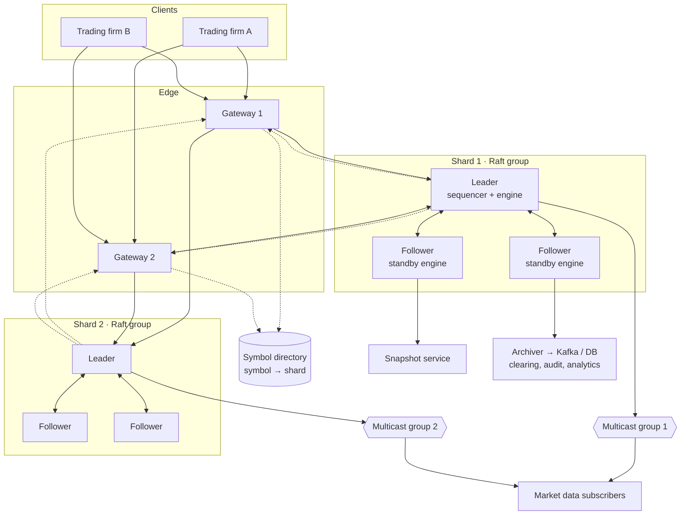

# trade-engine — High-Level Design

Written in the order you'd present it in a 45–60 min system design
interview. Deep "why" for each choice lives in
[DESIGN.md](DESIGN.md) (decisions D1–D9); this doc is the big picture.
Diagram version: [hld.html](hld.html).

| Step | Time | Section |
|---|---|---|
| 1. Clarify requirements | 5 min | §1 |
| 2. Estimate scale | 5 min | §2 |
| 3. Define APIs | 5 min | §3 |
| 4. High-level architecture | 10 min | §4 |
| 5. Data model | 5 min | §5 |
| 6. Deep dives | 15 min | §6 |
| 7. Failures, bottlenecks, trade-offs | 5–10 min | §7–8 |

---

## 1. Requirements

**Say first:** "An exchange that accepts buy/sell orders, matches
them, and tells everyone what happened, fast and without losing
anything. Let me pin down scope."

### Functional
1. Clients place **limit, market, IOC** orders and **cancel** them.
2. Matching by **price-time priority**.
3. Client gets an **execution report** for every state change
   (ack, partial fill, fill, cancel, reject).
4. Everyone gets **market data**: book changes and trades.
5. **Risk checks** before an order enters the book.
6. Ops can **halt** a symbol.

### Non-functional
| Property | Target | Why it matters |
|---|---|---|
| Latency (order in → ack out) | p99 < 1 ms, matching p99 < 10 µs | traders pick the fastest venue |
| Throughput | 5M orders/s total, 1M/s per shard | bursts at market open |
| Durability | acked order is never lost | money |
| Consistency | one true order book, strict ordering | fairness is a legal requirement |
| Availability | failover in < 1 s | halted market = lost business |
| Fairness | same input ⇒ same result | auditors replay the day |

### Out of scope
Auth/KYC, clearing & settlement, auctions, order modify
(= cancel + new), multi-asset.

**Key point to say:** "For an exchange, **consistency beats
availability**. If we can't be sure of the order of events, we
halt rather than match wrongly." (CP in CAP terms.)

---

## 2. Capacity estimation

Assumptions: 5,000 symbols, trading day 6.5 h (23,400 s),
peak 5M orders/s, average 500k orders/s, 1,000 client sessions.

| Quantity | Calculation | Result |
|---|---|---|
| Orders per day | 500k × 23,400 | ~12 billion |
| Order message size | fixed binary layout | 48 B |
| Log written per day | 12B × 48 B | ~560 GB (per replica) |
| Peak log write | 5M × 48 B | 240 MB/s total, 48 MB/s per shard |
| Replication traffic per shard leader | 48 MB/s × 2 followers | ~96 MB/s → 10 GbE |
| Market data out | ~1.5 events/order × 32 B × 5M | ~240 MB/s total |
| Book memory per symbol | 20k price levels × 2 sides × 32 B | ~1.3 MB |
| Live orders in memory | say 10M × 96 B | ~1 GB |
| Shards needed | 5M ÷ 1M, plus 50% headroom | **8 shards** |

**Takeaways to say out loud:**
- Everything live fits **in memory** (~1 GB), so no database on
  the hot path. The **log is the database**.
- Per-order budget at 1M/s per shard is **1 µs**, which rules out
  locks, allocation and syscalls per order.
- Disk and network are fine **if** the encoding is compact binary.

---

## 3. APIs

Clients connect over a **persistent TCP session** with a binary
protocol (real exchanges use FIX or OUCH; we use a simple fixed
layout). Not REST: HTTP headers and JSON parsing alone would blow
the latency budget.

### Client → exchange
```
NewOrder     { clOrdId: u64, symbolId: u32, side: BUY|SELL,
               type: LIMIT|MARKET|IOC, price: i64 (ticks),
               qty: u64 }                               // 48 B
CancelOrder  { clOrdId: u64, orderId: u64 }
Heartbeat    { }
```

### Exchange → client (execution reports)
```
Ack          { clOrdId, orderId, timestamp }
Fill         { orderId, fillPrice, fillQty, leavesQty, tradeId }
Cancelled    { orderId, reason }
Rejected     { clOrdId, reason: RISK|HALTED|BAD_PRICE|THROTTLED }
```

### Exchange → everyone (market data, UDP multicast)
```
Header       { seqNo: u64, count: u16 }        // gap detection
AddOrder     { orderId, symbolId, side, price, qty }
Executed     { orderId, qty, tradeId }
Deleted      { orderId }
Trade        { symbolId, price, qty, tradeId }
```
Plus a **TCP snapshot service**: "give me the book for symbol X as
of seqNo N" for late joiners and gap recovery.

**Key point:** market data publishes **individual orders**, not
just aggregated levels, so subscribers can rebuild the exact book.

---

## 4. High-level architecture



### Components

| Component | Job | State | Scales by |
|---|---|---|---|
| **Gateway** | TCP sessions, decode, risk checks, rate limit, route by symbol | session state, client positions | add gateways; each client pinned to one |
| **Symbol directory** | symbol → shard mapping, halts, tick sizes | small config | cached in every gateway |
| **Sequencer** (inside shard leader) | assign sequence no. + timestamp, append to Raft log, replicate | Raft log | one per shard |
| **Matching engine** | apply committed commands to books, emit events | order books in memory | one thread per shard; add shards |
| **Followers** | replicate log, run standby engine | same as leader | 3 nodes per shard (tolerates 1 failure) |
| **Publisher** | send market data + exec reports | outbound buffers | per shard |
| **Snapshot service** | serve book snapshots for recovery | reads from a follower | read replicas |
| **Archiver** | stream committed log to Kafka/DB | none | off the hot path, can lag |

### Order flow (happy path)
1. Client sends `NewOrder` → **gateway** decodes, runs risk checks,
   looks up the shard for the symbol.
2. Gateway forwards to the **shard leader**.
3. **Sequencer** stamps seq no. + time, appends to the log, and
   replicates to followers in a batch.
4. Once a **majority** has it, the command is **committed**.
5. **Matching engine** applies it: match or rest in the book.
6. **Publisher** sends the exec report back through the gateway
   and market data out on multicast.
7. **Followers** apply the same command to their standby books.
8. **Archiver** later ships it to Kafka/DB for clearing and audit.

**Key point:** steps 1–6 are the **hot path** and touch no
database, no Kafka, no locks. Everything slow (steps 7–8) happens
**after** the client has its answer, or on other machines.

---

## 5. Data model

### In memory (matching engine)
```
Order      { orderId: long, clientId: int, clOrdId: long,
             side: Side, type: OrderType, price: long, qty: long, leavesQty: long,
             timestamp: long,
             prev: Order, next: Order }   // intrusive list links

PriceLevel { price: long, totalQty: long,
             head: Order, tail: Order }   // FIFO = time priority

OrderBook  { symbolId: int,
             bids: PriceLevel[],          // index = price tick - base
             asks: PriceLevel[],
             bestBid: int, bestAsk: int } // cached indexes

orders     : LongObjectMap<Order>         // orderId → Order, O(1) cancel
dedup      : map (clientId, clOrdId) → orderId
```

### On disk (Raft log, per shard)
```
LogEntry   { term: long, index: long, commandType: byte,
             payload: bytes }             // the command, not the result
Snapshot   { lastIndex, lastTerm, all books + dedup map }
```

**Key point:** we store **commands, not state**. State = replaying
commands through a deterministic engine. Snapshots just shorten
replay time.

### Downstream (archiver → Kafka/DB)
`trades(tradeId, symbolId, buyOrderId, sellOrderId, price, qty, ts)`
for clearing, audit and analytics. Normal database, not latency
sensitive.

---

## 6. Deep dives

Pick 2–3 depending on what the interviewer pushes on.

### 6.1 Why one thread per shard? → DESIGN.md D1
Matching costs ~100s of ns. A lock handoff costs about the same.
Single thread = no locks, deterministic, cache stays hot.
Throughput comes from **more shards**, not more threads per book.

### 6.2 Order book structure → DESIGN.md D2
Array of price levels indexed by tick, FIFO linked list per level,
`orderId → Order` map. Insert, cancel, best price all **O(1)**.

### 6.3 Sharding and hot symbols
- Shard by **symbol**, because a match only ever involves one
  symbol. No cross-shard transaction ever needed.
- Placement is **not** a plain hash: a few symbols take most of the
  volume, so the directory assigns hot symbols to their **own
  shard** and packs quiet ones together.
- Moving a symbol = halt it, snapshot its book, load on new shard,
  update directory, resume. Done outside trading hours.

### 6.4 Replication and failover → DESIGN.md D5–D7
Raft per shard. Replicate **commands**, every node runs the same
engine. Leader dies → follower with the most up-to-date log wins
the election, its book is already identical. Clients resend
un-acked orders with the same `clOrdId`, dedup makes it safe.

### 6.5 Durability vs latency → DESIGN.md D6
Group commit: many orders, one disk flush, one network round trip.
Ack after a **majority** has the entry. Batch size is the knob
that trades latency for throughput.

### 6.6 Market data at scale → DESIGN.md D9
UDP multicast: send once, the network fans it out. Sequence
numbers show gaps; subscribers recover from the snapshot service.
The engine never waits for a slow subscriber.

### 6.7 Fairness
Order of arrival at the **sequencer** is the official order.
Gateways add no priority; each client gets the same path length.
Same log ⇒ same trades, so auditors can replay any day.

---

## 7. Failure handling

| Failure | Effect | Handling |
|---|---|---|
| Shard leader dies | shard pauses | Raft election (~150–300 ms), standby takes over |
| Follower dies | none (majority still up) | catches up from log / snapshot |
| Network partition | two sides | minority side can't commit → rejects orders |
| Gateway dies | its clients disconnect | clients reconnect to another gateway, resend un-acked |
| Engine overloaded | ring buffer fills | gateway rejects with `THROTTLED` (backpressure) |
| Market data packet lost | subscriber sees gap | snapshot + replay |
| Bug gives bad trades | wrong fills | halt symbol, fix, replay log |
| Whole data centre down | outage | async replica in second DC (manual failover, may lose last ms) |

---

## 8. Bottlenecks & trade-offs

| Trade-off | We chose | We gave up |
|---|---|---|
| Consistency vs availability | consistency (halt if unsure) | uptime during partitions |
| Latency vs durability | ack after majority, batched fsync | a few µs per order |
| Single thread vs parallel | single thread per shard | per-shard ceiling (~1M/s) |
| Binary vs JSON | binary | human readability, easy debugging |
| Multicast vs TCP for market data | multicast | built-in reliability (we add seqNo + recovery) |
| Array book vs tree | array | only works within a price band |
| Sync vs async DR replica | async | may lose the last moments in a DC loss |

### "What if traffic grows 10×?"
1. More shards (split symbols further). Hot symbols get dedicated
   hardware.
2. More gateways; gateways are almost stateless.
3. Kernel-bypass networking (e.g. DPDK / Solarflare) for gateways
   and multicast.
4. Beyond that, a single symbol's ceiling is one core; the answer
   is a faster core and fewer cache misses, not more threads.

---

## 9. One-minute summary (end the interview with this)

> Clients send binary orders over TCP to stateless-ish gateways
> that check risk and route by symbol. Each symbol lives on one
> shard: a 3-node Raft group whose leader sequences commands,
> replicates them with group commit, and feeds a single-threaded
> deterministic matching engine that keeps the whole book in
> memory in arrays. Followers run the same engine, so failover is
> instant. Results go back as exec reports and out as multicast
> market data with sequence numbers. Everything slow, like
> archiving and clearing, happens off the hot path. We chose
> consistency over availability, and batching is the knob that
> trades latency for throughput.
